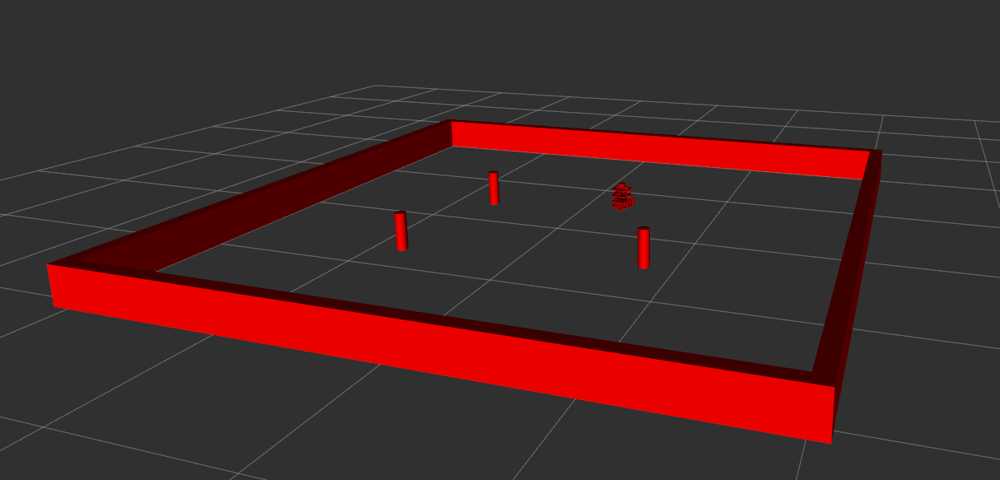

# Nusim
A simulated environment for the Nuturtle robot. This package provides a ground-truth simulation authorized to manage robot poses, arena boundaries, and obstacles. It integrates with RViz2 for 3D visualization using standard ROS 2 message types.

## Visualization
Below is a screenshot of the simulation environment including the "red" ground-truth robot, the arena walls, and cylindrical obstacles.

## Launch Files
* **`nusim.launch.xml`**: The primary entry point for the simulation.
    * Starts the `nusimulator` node.
    * Loads the "red" robot model using `nuturtle_description`.
    * Launches `rviz2` with a pre-configured view.
    * **Arguments**:
        * `config_file`: Path to a `.yaml` file to configure the simulator. (Default: `config/basic_world.yaml`).

## Parameters
The `nusimulator` node is configured via the following parameters:

### Simulation Settings
* **`rate`** (int): The frequency of the simulation loop in Hz. Default: `100`.
* **`timestep`** (uint64): Published to `~/timestep`, tracks the number of simulation cycles since start/reset.

### Robot Initial Pose
* **`x0`** (float): Initial x-coordinate of the robot in `nusim/world`. Default: `0.0`.
* **`y0`** (float): Initial y-coordinate of the robot in `nusim/world`. Default: `0.0`.
* **`theta0`** (float): Initial heading of the robot in radians. Default: `0.0`.

### Arena Geometry
* **`arena_x_length`** (float): Length of the rectangular arena along the x-axis (meters).
* **`arena_y_length`** (float): Length of the rectangular arena along the y-axis (meters).

### Obstacles
* **`obstacles.x`** (double_array): List of x-coordinates for cylindrical obstacles.
* **`obstacles.y`** (double_array): List of y-coordinates for cylindrical obstacles.
* **`obstacles.r`** (float): The radius of the obstacles in meters.

## Services
* **`~/reset`** (`std_srvs/srv/Empty`): Restores the simulation to the initial state defined by the current parameters. This resets the timestep to zero and teleports the robot back to $(x_0, y_0, \theta_0)$.