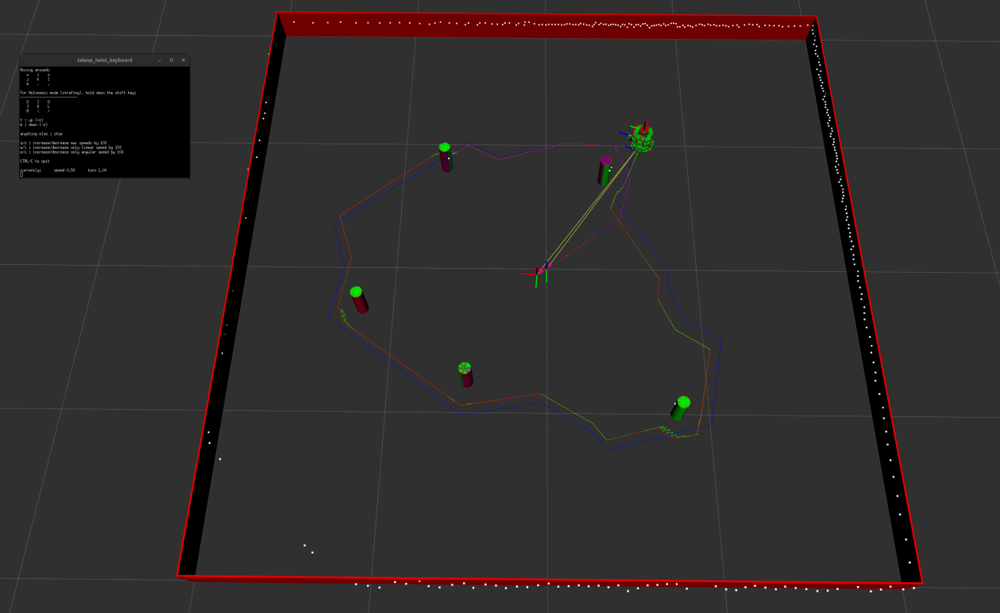

# Nuslam

A Feature-Based Extended Kalman Filter (EKF) SLAM implementation for the Nuturtle robot.
This package enables the robot to estimate its own pose and the locations of landmarks
simultaneously, correcting odometry drift using laser scan measurements.

## Visualization

The SLAM system visualizes three distinct robot states to demonstrate filter performance:

- **Red Robot**: Ground truth (actual position from the simulator).
- **Blue Robot**: Pure odometry (uncorrected, accumulates drift).
- **Green Robot**: SLAM estimate (EKF-corrected using landmark observations).

## Demo

### Unknown Data Association — Closed Loop

The following screencast shows the robot completing a closed-loop circular path among
five cylindrical landmarks using the unknown data association SLAM pipeline.  The green
robot and green path track the EKF estimate, the blue robot and blue path show raw
odometry drift, and the red robot and red path show the simulator ground truth.  Green
cylinder markers are the SLAM-estimated landmark positions; red cylinders are the true
obstacle positions.

https://private-user-images.githubusercontent.com/189086001/567270831-570b31c0-159e-4ac9-b780-abfab9e5b0f5.webm?jwt=eyJ0eXAiOiJKV1QiLCJhbGciOiJIUzI1NiJ9.eyJpc3MiOiJnaXRodWIuY29tIiwiYXVkIjoicmF3LmdpdGh1YnVzZXJjb250ZW50LmNvbSIsImtleSI6ImtleTUiLCJleHAiOjE3NzQwOTc0NzgsIm5iZiI6MTc3NDA5NzE3OCwicGF0aCI6Ii8xODkwODYwMDEvNTY3MjcwODMxLTU3MGIzMWMwLTE1OWUtNGFjOS1iNzgwLWFiZmFiOWU1YjBmNS53ZWJtP1gtQW16LUFsZ29yaXRobT1BV1M0LUhNQUMtU0hBMjU2JlgtQW16LUNyZWRlbnRpYWw9QUtJQVZDT0RZTFNBNTNQUUs0WkElMkYyMDI2MDMyMSUyRnVzLWVhc3QtMSUyRnMzJTJGYXdzNF9yZXF1ZXN0JlgtQW16LURhdGU9MjAyNjAzMjFUMTI0NjE4WiZYLUFtei1FeHBpcmVzPTMwMCZYLUFtei1TaWduYXR1cmU9YWUxNjBjMTljNTlmODIxMjViNjU0OWM5NDhmYjQ4NjQ2ZjgyM2JlZWZjNGJiN2FkZDgwNGZmNGJiMzg0ZDk5YiZYLUFtei1TaWduZWRIZWFkZXJzPWhvc3QifQ.I-s_8fNOrAkYkz_QQQ5ow6lJuSLrA_rYgFwT9vxbpIE

### Final Convergence Screenshot



## Algorithm

### Landmark Detection

Raw 2D laser scan data is processed by the `landmarks` node in three stages:

1. **Clustering** — consecutive scan points within a distance threshold (0.20 m) are
   grouped into clusters.  Clusters with fewer than 3 points are discarded.  A
   wrap-around merge handles clusters that straddle the 0°/360° scan boundary.

2. **Classification** — each cluster is tested against the Inscribed Angle Theorem
   (Xavier et al., ICRA 2005).  For a cluster lying on a circular arc, the angle
   subtended by the arc endpoints at any interior point is approximately constant.
   A cluster passes if the standard deviation of these angles is below 0.25 rad and
   the mean angle is between 80° and 170°.  This rejects wall segments, which have
   means near 0° or 180° and high standard deviation.

3. **Circle fitting** — clusters that pass classification are fit to a circle using
   the Pratt algebraic method (Al-Sharadqah and Chernov, Electronic Journal of
   Statistics, 2009).  The fitted radius is checked against the known pillar size;
   detections with radius outside [0.01, 0.12] m are discarded.

### EKF SLAM

The filter maintains a joint state vector
```
ξ = [x, y, θ, m₁ₓ, m₁ᵧ, …, mₙₓ, mₙᵧ]ᵀ
```

of size 3 + 2N, where N is the number of landmarks discovered so far.

**Prediction step** — wheel angle deltas from `red/joint_states` are converted to a
body-frame displacement via the differential-drive kinematics model.  The displacement
is rotated into the world frame and applied to the robot-pose block of ξ.  The
covariance Σ is propagated as Σ = F Σ Fᵀ + Q, where F is the linearised motion
Jacobian and Q is the process noise matrix (applied to the robot-pose block only).

**Data association** — each incoming landmark measurement is projected into the map
frame using the current SLAM pose estimate.  The nearest known landmark within a
Euclidean distance gate (0.5 m) is selected as the associated landmark.  If no
landmark falls within the gate the measurement is treated as a new landmark.

Euclidean distance is used instead of Mahalanobis distance because newly initialised
landmarks carry an initial covariance of 1×10⁶.  At this scale the Mahalanobis
distance collapses to near zero for every incoming measurement, causing systematic
false associations and filter divergence.

**Measurement update** — for each associated landmark the 2×(3+2N) range-bearing
Jacobian H is computed, the Kalman gain K = Σ Hᵀ (H Σ Hᵀ + R)⁻¹ is calculated, and
the state and covariance are updated:
```
ξ  ← ξ + K ν
Σ  ← (I − KH) Σ
```

where ν = z − ẑ is the innovation between the measured and predicted range-bearing
observation.

## Performance Results

### Landmark Estimation Error

Results after three laps at v = 0.1 m/s, r = 0.5 m with no slip noise.

| Landmark | True (x, y) [m]   | SLAM estimate (x, y) [m] | Error [m] |
|----------|-------------------|--------------------------|-----------|
| 0        | (-0.800,  1.000)  | (-0.783,  1.002)         | 0.017     |
| 1        | ( 0.500,  0.800)  | ( 0.516,  0.779)         | 0.026     |
| 2        | ( 0.700, -0.800)  | ( 0.683, -0.815)         | 0.023     |
| 3        | (-0.400, -0.700)  | (-0.409, -0.697)         | 0.009     |
| 4        | ( 1.200,  0.300)  | ( 1.200,  0.265)         | 0.035     |

**Mean landmark error: 0.022 m**

### Final Robot Pose Error

Results after one complete closed loop, v = 0.1 m/s, r = 0.5 m.
Ground truth final pose is the origin (x = 0, y = 0, θ = 0).

| Estimate                  | x error [m] | y error [m] | Total error [m] |
|---------------------------|-------------|-------------|-----------------|
| Odometry vs Ground Truth  | 0.000       | 0.000       | 0.000           |
| SLAM vs Ground Truth      | 0.002       | 0.002       | 0.003           |

The SLAM estimate returns to within 3 mm of the origin after one complete loop.
Odometry error is near zero for this test because the simulator runs without slip
noise (`slip_fraction = 0.0`); the SLAM correction becomes essential under realistic
noise conditions.

## Launch Files

### `unknown_data_assoc.launch.xml`

Runs the full unknown data association SLAM pipeline in simulation.
```bash
ros2 launch nuslam unknown_data_assoc.launch.xml cmd_src:=circle
```

Then start the robot moving:
```bash
ros2 service call /control nuturtle_control/srv/Control \
  "{velocity: 0.1, radius: 0.5}"
```

To stop:
```bash
ros2 service call /stop std_srvs/srv/Empty {}
```

**Arguments:**

| Argument      | Default                              | Description                          |
|---------------|--------------------------------------|--------------------------------------|
| `config_file` | `nusim/config/basic_world.yaml`      | World parameters (obstacles, arena). |
| `rviz_config` | `nuslam/config/unknown_data_assoc.rviz` | RViz layout.                      |
| `cmd_src`     | `circle`                             | `circle` or `teleop`.                |

### `landmark_detect.launch.xml`

Runs landmark detection only (no SLAM), for debugging the sensor pipeline.
```bash
ros2 launch nuslam landmark_detect.launch.xml
```

## TF Tree
```
nusim/world (static)
├── red/base_footprint      ← ground truth from nusimulator
│   └── red/base_link
│       └── red/base_scan
└── map (static identity with nusim/world)
    ├── green/base_footprint ← SLAM estimate (published by slam node)
    │   └── green/base_link
    └── odom (static identity with map)
        └── blue/base_footprint ← raw odometry from odometry node
            └── blue/base_link
```

## Parameters

### `slam` node

| Parameter          | Default | Description                                       |
|--------------------|---------|---------------------------------------------------|
| `wheel_radius`     | 0.033   | Wheel radius [m].                                 |
| `track_width`      | 0.16    | Distance between wheel centres [m].               |
| `process_noise`    | 0.001   | Robot-pose process noise variance.                |
| `sensor_noise`     | 0.1     | Range and bearing sensor noise variance.          |
| `assoc_threshold`  | 0.5     | Euclidean distance gate for data association [m]. |

### `landmarks` node

| Parameter       | Default | Description                                                  |
|-----------------|---------|--------------------------------------------------------------|
| `threshold`     | 0.15    | Distance threshold for clustering adjacent scan points [m].  |
| `laser_height`  | 0.172   | Height of laser scan frame above ground plane [m].           |

## Topics

| Topic                         | Type                                    | Description                          |
|-------------------------------|-----------------------------------------|--------------------------------------|
| `/slam/path`                  | `nav_msgs/msg/Path`                     | Green SLAM estimated trajectory.     |
| `/slam/map_landmarks`         | `visualization_msgs/msg/MarkerArray`    | Green estimated landmark cylinders.  |
| `/landmarks/detected_landmarks` | `visualization_msgs/msg/MarkerArray`  | Magenta detected landmark cylinders. |
| `/landmarks/clusters`         | `visualization_msgs/msg/MarkerArray`    | Coloured cluster debug points.       |
| `/odometry/path`              | `nav_msgs/msg/Path`                     | Blue odometry trajectory.            |
| `/nusimulator/path`           | `nav_msgs/msg/Path`                     | Red ground truth trajectory.         |