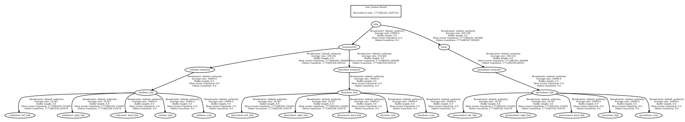

# Nuslam
A Feature-Based Extended Kalman Filter (EKF) SLAM implementation for the Nuturtle robot. This package enables the robot to estimate its own pose and the locations of landmarks simultaneously, effectively correcting odometry drift using sensor measurements.

## Visualization
The SLAM system visualizes three distinct robot states to demonstrate the filter's performance:
* **Red Robot**: Ground Truth (the actual physical location in the simulation).
* **Blue Robot**: Pure Odometry (uncorrected position).
* **Green Robot**: SLAM Estimate (the EKF's best guess, corrected by landmark sightings).

### SLAM Performance Demo

The video demonstrates the performance of the Extended Kalman Filter (EKF) SLAM algorithm during a simulated navigation task involving high odometry noise and physical collisions. The visualization displays the divergence between uncorrected wheel odometry and the SLAM state estimate. When the robot encounters a boundary, the uncorrected odometry pose continues to accumulate position data based on wheel rotation, while the SLAM estimate remains stationary and aligned with the ground truth robot. This behavior is driven by the EKF correction step, which utilizes relative landmark measurements from the sensor model to calculate the map-to-odom transform, effectively counteracting the integration error of the kinematic model.

https://private-user-images.githubusercontent.com/189086001/557105547-0cc00070-2560-4a84-9648-7b7a0073ec52.webm?jwt=eyJ0eXAiOiJKV1QiLCJhbGciOiJIUzI1NiJ9.eyJpc3MiOiJnaXRodWIuY29tIiwiYXVkIjoicmF3LmdpdGh1YnVzZXJjb250ZW50LmNvbSIsImtleSI6ImtleTUiLCJleHAiOjE3NzI0ODMyMzUsIm5iZiI6MTc3MjQ4MjkzNSwicGF0aCI6Ii8xODkwODYwMDEvNTU3MTA1NTQ3LTBjYzAwMDcwLTI1NjAtNGE4NC05NjQ4LTdiN2EwMDczZWM1Mi53ZWJtP1gtQW16LUFsZ29yaXRobT1BV1M0LUhNQUMtU0hBMjU2JlgtQW16LUNyZWRlbnRpYWw9QUtJQVZDT0RZTFNBNTNQUUs0WkElMkYyMDI2MDMwMiUyRnVzLWVhc3QtMSUyRnMzJTJGYXdzNF9yZXF1ZXN0JlgtQW16LURhdGU9MjAyNjAzMDJUMjAyMjE1WiZYLUFtei1FeHBpcmVzPTMwMCZYLUFtei1TaWduYXR1cmU9ODA1OTg5MjRkNDcwMTFkMWNlMmQ2YzgzMTBjNDMxYTYxYWMxYmJmNTEzOTQ0MzljM2ZkZjA2Y2I0OTJiNDc5OSZYLUFtei1TaWduZWRIZWFkZXJzPWhvc3QifQ.Q6OuVInHQdV18qytJUUN3kqNoKBVFV4suvffMEVtzNI

### Final Convergence Screenshot

The screenshot captures the final state of the system after completing a closed-loop path among five landmarks. The red robot and red path represent the ground truth trajectory provided by the simulator, while the green robot and green path indicate the SLAM state estimate derived from the joint robot-landmark state vector. The blue path illustrates the trajectory calculated through pure dead reckoning, showing significant lateral and longitudinal drift. Cylindrical green markers represent the estimated landmark positions calculated by the filter, which are overlaid with the actual simulator obstacles to show the convergence of the landmark sub-states. The transform tree correctly displays the relationship between the static world frame and the dynamic correction of the odometry frame.


## Launch Files
* **`slam.launch.xml`**: The primary entry point for running SLAM in simulation.
    * Starts the `nusimulator` node (simulated world).
    * Starts the `slam` node (EKF estimator).
    * Launches `robot_state_publisher` for red, blue, and green namespaces.
    * Opens `rviz2` with a configuration showing paths and landmarks.
    * **Arguments**:
        * `robot` (string): Set to `nusim` for simulation mode. (Default: `nusim`).
        * `cmd_src` (string): Source of movement commands. Set to `teleop` for manual control.
        * `input_noise` (double): Noise added to robot motion.
        * `slip_fraction` (double): Wheel slip ratio.
        * `max_range` (double): Sensing radius for landmarks.

## Execution Instructions
To run SLAM with the recommended parameters for Task L.2/V.4 (enabled noise and limited sensor range):

```bash
ros2 launch nuslam slam.launch.xml \
  robot:=nusim \
  cmd_src:=teleop \
  input_noise:=0.005 \
  slip_fraction:=0.03 \
  basic_sensor_variance:=0.0005 \
  max_range:=2.0
```

## EKF SLAM Implementation Details
The package implements a standard Feature-Based Extended Kalman Filter (EKF) SLAM algorithm:

* **State Vector**: Maintains a joint state vector $\xi$ of size $(3 + 2N)$, where $N$ is the number of landmarks:
    $$\xi = [x, y, \theta, m_{0,x}, m_{0,y}, \dots, m_{N,x}, m_{N,y}]^T$$
* **Prediction Step**: Uses a differential drive non-linear motion model to propagate the robot state. The covariance $\Sigma$ is propagated using the Jacobian of the motion model $G$ and the process noise $Q$:
    $$\Sigma_{t} = G_t \Sigma_{t-1} G_t^T + Q$$
* **Correction Step**: Uses a Cartesian measurement model. When a landmark is observed, the algorithm calculates the measurement Jacobian $H$ and the Kalman Gain $K$ to update the state vector and covariance based on the innovation (difference between actual and predicted sensor readings).
* **Known Data Association**: The system utilizes unique landmark IDs provided by the `nusimulator` to correctly associate incoming measurements with the corresponding landmarks in the state vector.

---

## TF Tree Structure
To properly visualize the divergence between ground truth, raw odometry, and the SLAM estimate, the following TF hierarchy is maintained:

* **`nusim/world`**: The static absolute global frame (God frame).
    * `-> red/base_footprint`: Ground truth robot position from the simulator.
    * `-> blue/base_footprint`: Uncorrected odometry position (demonstrates drift and wall-ghosting).
    * `-> map`: The SLAM origin frame.
        * **`-> odom`**: Corrected by the SLAM node via the published `map` to `odom` transform.
            * `-> green/base_footprint`: The SLAM estimated robot pose.

### TF Tree Verification
Run the command below to get the tf tree:
```bash
ros2 run tf2_tools view_frames
```


## Topics
* **`~/path`** (`nav_msgs/msg/Path`): The **green** path representing the SLAM estimate.
* **`~/odom_path`** (`nav_msgs/msg/Path`): The **blue** path representing uncorrected odometry drift.
* **`~/slam_obstacles`** (`visualization_msgs::msg::MarkerArray`): **Green** cylindrical markers representing estimated landmark locations.
* **`green/joint_states`** (`sensor_msgs/msg/JointState`): Joint positions for the **green** robot model wheels.
* **`/red/joint_states`** (`sensor_msgs/msg/JointState`): Input encoder data from the simulation (**red** robot).
* **`/fake_sensor`** (`visualization_msgs/msg/MarkerArray`): Noisy relative landmark measurements used for EKF correction.

## Parameters
The `slam` node is configured via the following parameters:

### Frame IDs
* **`body_id`** (string): The frame ID for the green robot body. (Default: `green/base_footprint`)
* **`odom_id`** (string): The frame ID for the odometry frame. (Default: `odom`)
* **`map_id`** (string): The frame ID for the SLAM map frame. (Default: `map`)

### Robot Geometry
* **`wheel_radius`** (double): Radius of the robot wheels [m].
* **`track_width`** (double): Distance between the wheels [m].
