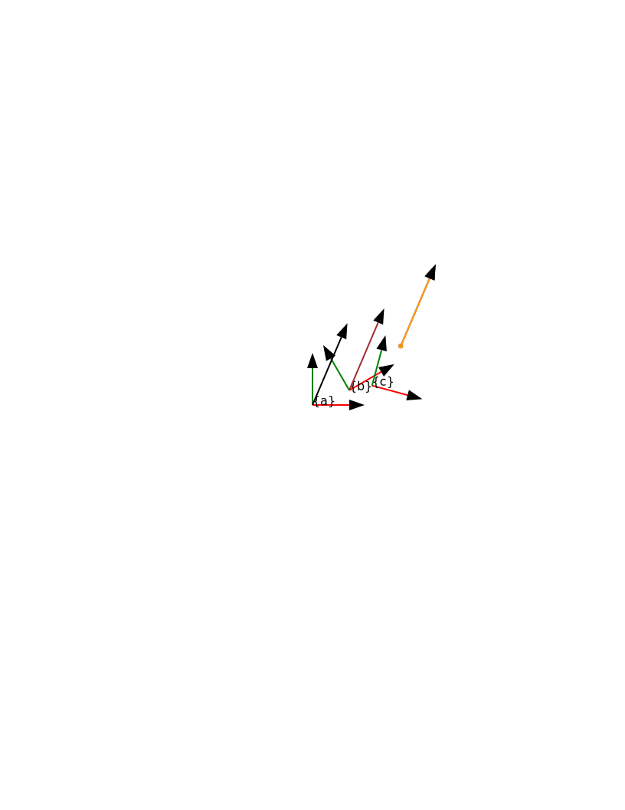

# Turtlelib
A standalone C++ library for 2D rigid body transformations, geometric primitives, and visualization, designed for the Nuturtle robot project.

## Library Components
* **angle.hpp**: Provides functions for angular math, including degree/radian conversions and angle normalization to the $(-\pi, \pi]$ range.
* **geometry2d.hpp**: Defines basic 2D primitives such as `Point2D` and `Vector2D`, including support for vector normalization, addition, subtraction, and custom I/O streaming.
* **se2d.hpp**: Implements $SE(2)$ rigid body transformations (`Transform2D`) and twists (`Twist2D`), supporting composition, inversion, and adjoint transformations.
* **svg.hpp**: A utility for exporting 2D geometric objects (Points, Vectors, and Coordinate Frames) into SVG (Scalable Vector Graphics) files for visualization.

## Tools and Examples

### 1. Angle Converter
A CLI tool to convert angles between degrees and radians while applying normalization.
* **Run command**: 
    `./install/turtlelib/bin/converter` or `converter`

### 2. Frame Transformation Visualization
A program that calculates various coordinate transformations between three frames ({a}, {b}, and {c}) and outputs the result to an SVG file.
* **Run command**:
    ```bash
    ./install/turtlelib/bin/frame_main
    ```
* **Generate Output and SVG**: 
    To run the program with a transcript input and capture the results:
    ```bash
    # Run with input redirection and save results to output file
    ./install/turtlelib/bin/frame_main < src/turtlelib/exercises/B6_frame_input.txt > src/turtlelib/exercises/B6_frame_output.txt

    # Copy the generated SVG to the exercises directory
    cp /tmp/frames.svg src/turtlelib/exercises/B6_frames.svg
    ```


## Build Instructions
To build the library and its associated tests/executables in a ROS 2 workspace:

1. **Build the library**:
    ```bash
    colcon build --packages-select turtlelib
    ```
2. **Build with Documentation**:
    ```bash
    colcon build --packages-select turtlelib --cmake-args -DBUILD_DOCS=ON
    ```
3. **Run Unit Tests**:
    ```bash
    colcon build --packages-select turtlelib --cmake-args -DBUILD_TESTING=ON
    ./build/turtlelib/test_se2d
    ```

## Example Visualization
The following image shows an example of coordinate frames and vectors exported using the `Svg` class:

